# Meesho Pragati Agent

    

<p align="center">
  <a href="https://pragati-agent.vercel.app" target="_blank">
    
  </a>
</p>

<p align="center">
  <strong>Live demo:</strong>
  <a href="https://pragati-agent.vercel.app" target="_blank">https://pragati-agent.vercel.app</a>
  &nbsp;|&nbsp;
  <strong>Demo video placeholder:</strong>
  <code>screenshot/video/Meesho-Pragati-Agent-Demo.mp4</code>
</p>

## 1. Project Introduction

### Meesho Pragati Agent
### Agentic AI for Inclusive Seller Lending in Bharat

### Theme
Building for Bharat with the Power of Agentic AI

Meesho Pragati Agent is an AI-powered financial growth platform for Meesho sellers. It helps sellers understand whether they are eligible for credit, why a loan decision was made, and what they can do to improve their business health over time. The product combines machine learning, business rules, multilingual AI coaching, and WhatsApp communication into one experience that is explainable, practical, and accessible for Bharat-scale sellers.

This project was built to address a critical gap in digital lending for small and emerging sellers. Many sellers are rejected not because they lack potential, but because current underwriting systems are too rigid, over-reliant on traditional credit data, and inaccessible to sellers who have strong business performance but limited formal financial history. Meesho Pragati Agent transforms that journey from a blunt rejection flow into a supportive, transparent, and growth-focused financial assistant.

The vision is simple: move from “reject and forget” to “understand, guide, and improve.” By combining agentic AI with explainable underwriting, the platform helps sellers improve eligibility over time rather than treating them as static credit risks.

---

## 2. Problem Statement

Traditional lending for sellers is often rigid and exclusionary. In the current Meesho Instant Cash journey, many sellers experience a process that is highly dependent on conventional credit signals such as CIBIL history, formal financial statements, and static risk checks. This creates friction for merchants who may be highly active and profitable on the platform but still get rejected because their financial profile is incomplete or not aligned with traditional underwriting frameworks.

### Why this is a real problem

- The current process is often binary: approve or reject.
- Traditional underwriting heavily depends on CIBIL and formal credit history.
- Many Bharat sellers operate in informal or semi-formal financial conditions.
- Tier-2 and Tier-3 sellers often have strong business activity but weak traditional credit footprints.
- These sellers are frequently rejected even when their platform behavior and operational signals suggest they are creditworthy.
- Traditional models fail to explain decisions clearly, which causes mistrust and low adoption.
- Transparent lending is required because sellers need to understand what went wrong and how to improve.

### Why this matters for Meesho Finance

For Meesho Finance, this is not just a product idea but a business-critical problem. Better underwriting can increase approval accuracy, reduce false rejections, improve seller trust, expand financial inclusion, and strengthen the overall seller ecosystem.

---

## 3. Solution (Short Overview)

Meesho Pragati Agent acts as an AI Financial Growth Partner for sellers. Instead of rejecting sellers outright, the system collects seller performance signals, runs ML-based underwriting, applies business rules, explains each decision in plain language, provides multilingual coaching, and can communicate using WhatsApp. Over time, sellers receive practical suggestions that help improve their eligibility and financial health.

---

## 4. Live Deployment Links

| Purpose | Link |
|---|---|
| Main Project URL |https://pragati-agent.vercel.app|
| Frontend (Vercel) |https://pragati-agent.vercel.app|
| Backend (Render) | https://pragati-backend-5xq8.onrender.com|
| ML Model Deployment |https://pragati-ml-model.onrender.com |
| GitHub Repository | https://github.com/anushkasj06/Pragati_Agent |
| Demo Video | Pending / Add your video link |
| Presentation | https://drive.google.com/file/d/1ORgfjPvHIERGya9hLfV6pp5P0FQwRdaV/view?usp=drive_link |


---

## 5. Project Setup Guide

This section is written so anyone can set up the project locally from scratch.

### Prerequisites

Before you start, make sure you have:

- Node.js 22+
- Python 3.11+
- Docker and Docker Compose
- MongoDB (local instance or Atlas)
- Git
- A Groq API key
- A Google Cloud project and service account credentials (optional for translation)

### Clone the repository

```bash
git clone <your-repo-url>
cd Messho
```

### Frontend setup

```bash
cd frontend
cp .env.example .env
npm install
npm run dev
```

The frontend will typically run at:

- http://localhost:3000

If you want a production build:

```bash
npm run build
```

### Backend setup

```bash
cd backend
cp .env.example .env
npm install
npm run dev
```

The backend will typically run at:

- http://localhost:3001
- Health check: http://localhost:3001/health
- API docs: http://localhost:3001/api-docs

### ML setup

```bash
cd ml-model
python -m venv venv
source venv/bin/activate
pip install -r requirements.txt
uvicorn app.main:app --reload --port 5001
```

The ML service will typically run at:

- http://localhost:5001/health
- API docs: http://localhost:5001/docs

### MongoDB setup

You can use either:

- a local MongoDB instance
- MongoDB Atlas
- Docker Compose (recommended for local development)

#### Option A: Docker Compose

```bash
docker compose up -d mongodb
```

#### Option B: MongoDB Atlas

1. Create a cluster in MongoDB Atlas.
2. Create a database user.
3. Whitelist your IP address.
4. Copy the connection string.
5. Put it into the backend environment file.

### Start everything together

From the project root:

```bash
docker compose up --build
```

### How to test the APIs

#### Health checks

```bash
curl http://localhost:3001/health
curl http://localhost:5001/health
```

#### Evaluate a seller

```bash
curl -X POST http://localhost:3001/api/loan/evaluate \
  -H "Content-Type: application/json" \
  -d '{
    "seller_id": "SELL_00123",
    "language": "English",
    "seller_data": {
      "sales_velocity_6m": 120000,
      "sales_growth_rate": 16,
      "rto_rate": 8,
      "dispatch_sla_compliance": 90,
      "avg_customer_rating": 4.2,
      "rating_trend": 0.12,
      "order_cancellation_rate": 6,
      "ad_spend_roi": 2.6,
      "account_age_months": 18,
      "total_orders_6m": 4600,
      "catalog_size": 220,
      "prior_loan_default": 0
    }
  }'
```

### How to verify success

The project is running correctly when:

- frontend loads without console errors
- backend responds to /health
- the ML endpoint responds to /health
- loan evaluation returns a structured decision JSON
- MongoDB stores applications and decisions

---

## 6. Environment Variables

The repository already includes example files for the frontend and backend:

- [backend/.env.example](backend/.env.example)
- [frontend/.env.example](frontend/.env.example)

### 6.1 Frontend environment variables

Create a file named `.env` inside the frontend folder.

```env
VITE_API_URL=http://localhost:3001
```

#### What it does

- `VITE_API_URL`: base URL for the backend API used by the React app.

### 6.2 Backend environment variables

Create a file named `.env` inside the backend folder.

```env
PORT=3001
NODE_ENV=development
MONGODB_URI=mongodb://localhost:27017/pragati_agent
ML_SERVICE_URL=http://localhost:5001
CORS_ORIGINS=http://localhost:3000,http://localhost:5173
GROQ_API_KEY=your-groq-api-key
GROQ_MODEL=llama-3.1-8b-instant
GROQ_API_BASE_URL=https://api.groq.com/openai/v1
GOOGLE_PROJECT_ID=your-google-project-id
GOOGLE_APPLICATION_CREDENTIALS=./gcp-credentials.json
TWILIO_ACCOUNT_SID=your-twilio-sid
TWILIO_AUTH_TOKEN=your-twilio-auth-token
TWILIO_WHATSAPP_NUMBER=whatsapp:+14155238886
```

#### Variable explanations

| Variable | Required | Description |
|---|---:|---|
| `PORT` | Yes | Backend port |
| `NODE_ENV` | Yes | Environment mode |
| `MONGODB_URI` | Yes | MongoDB connection string |
| `ML_SERVICE_URL` | Yes | URL of the FastAPI ML service |
| `CORS_ORIGINS` | Yes | Allowed frontend domains |
| `GROQ_API_KEY` | Yes for AI features | Groq API authentication |
| `GROQ_MODEL` | Optional | Model name |
| `GROQ_API_BASE_URL` | Optional | Groq endpoint |
| `GOOGLE_PROJECT_ID` | Optional | Google Translation project ID |
| `GOOGLE_APPLICATION_CREDENTIALS` | Optional | Path to service account JSON |
| `TWILIO_ACCOUNT_SID` | Optional | Twilio SID |
| `TWILIO_AUTH_TOKEN` | Optional | Twilio auth token |
| `TWILIO_WHATSAPP_NUMBER` | Optional | Sender WhatsApp number |

#### How to obtain each credential

##### Groq API Key

1. Go to https://console.groq.com
2. Create or sign in to an account.
3. Open API Keys.
4. Create a new key.
5. Copy it to `backend/.env` as `GROQ_API_KEY`.

##### MongoDB Atlas

1. Create an account at https://www.mongodb.com/atlas
2. Create a cluster.
3. Create a database user.
4. Network access: allow your current IP.
5. Copy the connection string and set `MONGODB_URI`.

##### Google Cloud Translation API

1. Open https://console.cloud.google.com
2. Create or select a project.
3. Enable the Cloud Translation API.
4. Create a service account.
5. Grant it the `Cloud Translation API User` role.
6. Download the JSON key file.
7. Save it somewhere safe, for example `backend/gcp-credentials.json`.
8. Set `GOOGLE_APPLICATION_CREDENTIALS=./gcp-credentials.json`.
9. Set `GOOGLE_PROJECT_ID=your-project-id`.

##### Twilio SID and Auth Token

1. Sign up at https://www.twilio.com
2. Open your Twilio dashboard.
3. Copy the Account SID and Auth Token.
4. Put them in `backend/.env`.
5. Configure a WhatsApp sandbox or approved sender number.

### 6.3 Python ML environment variables

The current FastAPI app does not require a dedicated `.env` file for inference logic. The service runs using the port passed to `uvicorn`.

If you want to create an ML `.env` file anyway, you may use:

```env
PORT=5001
```

### 6.4 Render / Vercel deployment variables

If you deploy to Render or Vercel, set the following values:

| Platform | Variable | Example |
|---|---|---|
| Render (backend) | `PORT` | `3001` |
| Render (backend) | `MONGODB_URI` | `mongodb+srv://...` |
| Render (backend) | `ML_SERVICE_URL` | `https://your-ml-service.onrender.com` |
| Render (backend) | `GROQ_API_KEY` | your key |
| Render (backend) | `GOOGLE_PROJECT_ID` | your project id |
| Render (backend) | `GOOGLE_APPLICATION_CREDENTIALS` | `/etc/secrets/gcp-credentials.json` |
| Vercel (frontend) | `VITE_API_URL` | `https://your-backend.onrender.com` |

---

## 7. Project Documentation

The repository already contains important supporting documents and architecture assets.

### Documentation files

- [Anushka's_Team_2_Messho_Pragati_Agent.pdf](Anushka's_Team_2_Messho_Pragati_Agent.pdf) — full team presentation and project overview.
- [MEESHO PRAGATI AGENT Diagram.pdf](MEESHO%20PRAGATI%20AGENT%20Diagram.pdf) — architecture and workflow diagram.
- [Meesho_Pragati_Agent_Documentation.pdf](Meesho_Pragati_Agent_Documentation.pdf) — detailed implementation and product documentation.
- [DEPLOYMENT_QUICK_REFERENCE.md](DEPLOYMENT_QUICK_REFERENCE.md) — deployment checklist for Render and Vercel.
- [GOOGLE_TRANSLATION_SETUP.md](GOOGLE_TRANSLATION_SETUP.md) — Google translation setup instructions.


---

## 8. Complete Solution Architecture

The project follows a multi-layer architecture that starts from seller input and ends in an explainable financial decision and coaching response.

### End-to-end flow

1. A seller or admin opens the web experience.
2. The frontend collects seller metrics or application details.
3. The backend validates the request and routes it to the ML service.
4. The ML service returns a risk score and loan estimate.
5. The business rules engine applies deterministic lending logic.
6. The agentic AI layer produces a seller-friendly explanation and improvement plan.
7. Translation may convert the response into the requested language.
8. WhatsApp notifications can send the final guidance to the seller.
9. Application and decision information is stored in MongoDB.

### Component responsibilities

| Component | Responsibility |
|---|---|
| Frontend | Seller UI, evaluation form, admin dashboard, multilingual UI |
| Backend | API orchestration, validation, persistence, agent orchestration, Twilio integration |
| MongoDB | Storing seller data, loan applications, histories, notifications, translations |
| ML Model | Risk scoring and loan-limit estimation |
| Business Rules | Hard constraints, caps, manual review logic, rejection rules |
| Groq LLM | Natural language reasoning, coaching, and explanation generation |
| Translation API | Multilingual response generation |
| Twilio / WhatsApp | Seller-facing messaging |

### Mermaid architecture diagram

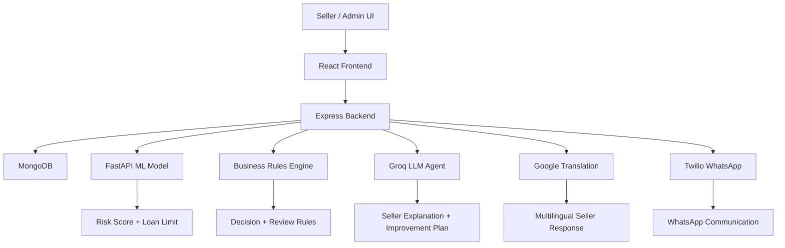

---

## 9. Dataset Creation

Real Meesho seller financial data was not available in the repository for training, so a synthetic dataset was created to simulate realistic seller behaviors.

### Why a synthetic dataset was created

- Real financial datasets are sensitive and not publicly available.
- Lending data requires privacy and compliance considerations.
- The goal of this prototype is to demonstrate the full underwriting flow rather than to release real financial data.

### Features used

The training dataset includes the following features:

| Feature | Description |
|---|---|
| `sales_velocity_6m` | Recent sales strength |
| `sales_growth_rate` | Momentum in sales growth |
| `rto_rate` | Return-to-origin rate |
| `dispatch_sla_compliance` | Delivery reliability |
| `avg_customer_rating` | Customer satisfaction |
| `rating_trend` | Recent rating trends |
| `order_cancellation_rate` | Cancellation behavior |
| `ad_spend_roi` | Efficiency of ad investments |
| `account_age_months` | Seller account maturity |
| `total_orders_6m` | Order volume |
| `catalog_size` | Product catalog size |
| `prior_loan_default` | Historical default signal |

### Sample rows

```text
seller_id,sales_velocity_6m,sales_growth_rate,rto_rate,dispatch_sla_compliance,avg_customer_rating,rating_trend,order_cancellation_rate,ad_spend_roi,account_age_months,total_orders_6m,catalog_size,prior_loan_default,risk_class,loan_limit
SELL_00001,102589.18,18.58,14.09,91.69,3.9,0.091,7.03,2.08,55,5000,255,0,0,51294
SELL_00005,29538.92,-0.9789,20.62,66.42,2.70,-0.035,9.81,1.15,11,1447,121,1,2,0
```

### Data distribution and assumptions

- Class balance was preserved during train-test splitting.
- The dataset was designed to reflect realistic seller profiles across low, medium, and high-risk categories.
- Loan limits were modeled to be correlated with sales strength and operational quality.

---

## 10. Machine Learning Model

The project uses a dual-model ML pipeline:

- a classifier for risk class prediction
- a regressor for loan-limit prediction

### Data preprocessing

- Missing values were checked before training.
- Numerical features were used directly without heavy scaling because XGBoost handles them well.

### Feature engineering

The model uses direct business-relevant seller metrics as features. These metrics are more interpretable than opaque categorical features and are suitable for explainability-driven financial decisions.

### Train-test split

- 80% training, 20% testing
- Stratified split on risk class to preserve class balance

### Algorithm selection

The project uses XGBoost because it performs very well on structured tabular data and is known for strong predictive power with limited tuning.

### Training pipeline

The training script in [ml-model/train_model.py](ml-model/train_model.py) performs:

1. loading the synthetic dataset
2. defining features and targets
3. splitting data into train and test sets
4. training the classifier and regressor
5. evaluating metrics
6. generating SHAP explainability artifacts

### Hyperparameters

| Model | Hyperparameters |
|---|---|
| Risk Classifier | `n_estimators=200`, `max_depth=5`, `learning_rate=0.05`, `subsample=0.8`, `colsample_bytree=0.8`, `objective=multi:softprob`, `num_class=3` |
| Loan Regressor | `n_estimators=200`, `max_depth=5`, `learning_rate=0.05`, `subsample=0.8`, `colsample_bytree=0.8`, `objective=reg:squarederror` |

### Evaluation metrics

The current artifacts report:

| Metric | Value |
|---|---:|
| Accuracy | 0.92 |
| Precision | 0.9207 |
| Recall | 0.92 |
| F1 Score | 0.9202 |
| RMSE | 3910.72 |
| MAE | 2547.72 |
| R2 | 0.9711 |

### Explainability

The project generates SHAP-based artifacts to show why a model made a given decision. These outputs are saved under [ml-model/artifacts](ml-model/artifacts).

- [ml-model/artifacts/feature_importance.png](ml-model/artifacts/feature_importance.png)
- [ml-model/artifacts/shap_summary.png](ml-model/artifacts/shap_summary.png)

This is especially valuable in financial settings because it makes the underwriting process more transparent and auditable.

---

## 11. ML Model Response

The ML service returns a structured response that the backend uses for underwriting.

### Sample response

```json
{
  "risk_class": "Low Risk",
  "risk_score": 82,
  "loan_limit": 51294,
  "probability": 0.91,
  "confidence": 0.91,
  "reason_codes": [
    "strong_sales_velocity",
    "healthy_dispatch_compliance",
    "stable_customer_ratings"
  ],
  "improvement_suggestions": [
    "Maintain dispatch SLA above 90%",
    "Reduce returns and cancellations",
    "Keep customer ratings stable"
  ]
}
```

### Response fields

| Field | Meaning |
|---|---|
| `risk_class` | Low, Medium, or High risk |
| `risk_score` | Numeric score from the model |
| `loan_limit` | Suggested loan amount |
| `probability` | Model confidence for the predicted class |
| `confidence` | Confidence level for the output |
| `reason_codes` | Key reasons behind the recommendation |
| `improvement_suggestions` | Practical actions to increase eligibility |

The backend uses this response as an input to the business rules engine and then passes the combined decision to the agent layer.

---

## 12. Business Rule Engine

ML alone is not enough for financial decision-making. The project therefore combines model outputs with deterministic business rules.

### Rules implemented

- Maximum loan cap: the final loan limit is capped at a configured maximum.
- Young account protection: sellers with a short account history receive lower caps.
- Prior default + high RTO rejection: a serious combination triggers automatic rejection.
- Large loans require human review.
- Final values are rounded to a business-friendly amount.

### Why this matters

The rules layer prevents over-reliance on model output and adds operational safeguards that are necessary in real lending workflows.

---

## 13. Complete Agentic AI Flow

This is one of the most important parts of the project. The system is not just a chatbot; it is an agentic orchestration workflow.

### Agent breakdown

| Agent | Purpose | Input | Processing | Output | Next Agent |
|---|---|---|---|---|---|
| Data Collection Agent | Gathers seller metrics and request context | Seller form, seller ID, phone number | Normalizes fields and collects context | Structured seller context | Validation Agent |
| Validation Agent | Checks data completeness and formats | Seller context | Validates fields and ensures consistent schema | Validated payload | ML Underwriting Agent |
| ML Underwriting Agent | Produces risk score and loan estimate | Validated seller context | Calls the FastAPI model | Risk score, loan limit, reason codes | Business Rules Agent |
| Business Rules Agent | Applies deterministic policies | ML output + seller data | Runs lending thresholds and approve/reject logic | Final decision, review flag | Decision Agent |
| Decision Agent | Decides whether to approve, reject, or require review | ML + rules output | Combines the results into one decision | Decision object | Reasoning Agent |
| Reasoning Agent | Creates a human-readable explanation | Decision object | Builds seller-friendly reasoning and improvement plan | Seller explanation | Groq LLM Agent |
| Groq LLM Agent | Produces agentic natural language reasoning | Explanation context | Generates coached responses in the requested language | Seller message + auditor trail | Translation Agent |
| Translation Agent | Converts the response into the target language | Seller message | Uses Google Translation when needed | Translated response | WhatsApp Communication Agent |
| WhatsApp Communication Agent | Sends guidance to the seller | Final response | Formats and sends a WhatsApp message | Delivered communication | History Agent |
| History Agent | Persists the interaction | Messages and decision | Stores history and notifications | Saved conversation history | Monitoring Agent |
| Monitoring Agent | Observes failures and runtime issues | Logs and errors | Captures telemetry and fallback states | Debuggable audit trail | End |

### Why this is truly Agentic AI

This is not just an LLM responding to a single prompt. The workflow is composed of multiple specialized agents that coordinate around a decision-making goal. Each agent has a specific responsibility, the output of one becomes the input of another, and the system can fall back gracefully if one component is unavailable.

---

## 14. Groq LLM

Groq is used as the reasoning layer for the agentic workflow.

### Why Groq is used

- Fast inference speeds
- Structured response generation
- Good support for JSON-style outputs
- Useful for multilingual explanation and coaching

### What is sent to Groq

The backend sends structured inputs including:

- seller ID
- business metrics
- ML results
- business rules results
- conversation history
- target language

### How responses are generated

Groq is used to produce:

- seller-facing explanation text
- an auditor-style trail
- a practical improvement plan

### How hallucination is controlled

- The prompts instruct the LLM to use only the provided numbers.
- The system avoids inventing loan amounts or changing the computed decision.
- The AI is treated as a reasoning and coaching layer, not as the authority that approves or rejects loans.

> Groq is used for explanation and coaching, not for final underwriting authority.

---

## 15. Google Translation

The application supports multilingual seller communication through Google Cloud Translation.

### Why translation is needed

Many sellers in Bharat prefer communication in local languages. Translation makes the product more inclusive and helps reduce friction in financial guidance.

### Supported languages

The project supports:

- English
- Hindi
- Marathi
- Tamil
- Telugu
- Kannada
- Gujarati
- Malayalam

### Translation flow

1. The backend receives the seller’s requested language.
2. The agent generates the explanation in the requested language when possible.
3. If necessary, the backend uses the Google Translation API as a fallback.
4. The translated message is delivered to the seller.

### Benefits

- Better adoption among non-English-speaking sellers
- More inclusive financial support
- Better trust and communication quality

---

## 16. Twilio WhatsApp Integration

Twilio is used to send seller-facing WhatsApp updates and coaching messages.

### Full WhatsApp workflow

1. Seller onboarding creates or updates the seller profile in MongoDB.
2. The seller’s phone number is attached to the profile.
3. The seller sends a greeting like “Hi”.
4. The backend identifies the seller.
5. The system loads prior context and profile data.
6. The ML model is invoked.
7. Business rules are applied.
8. The agentic AI layer generates guidance.
9. Translation is applied if required.
10. The message is sent over WhatsApp.
11. The conversation is saved in MongoDB for future follow-up.

### Mermaid WhatsApp flow

```mermaid
flowchart LR
    A[Seller sends Hi] --> B[Backend identifies seller]
    B --> C[Load seller profile]
    C --> D[Run ML model]
    D --> E[Run business rules]
    E --> F[Run agentic AI reasoning]
    F --> G[Translate if needed]
    G --> H[Send WhatsApp message]
    H --> I[Store conversation history]
```

---

## 17. Real Meesho Integration

The current repository contains a demo-style prototype, but the architecture is designed to evolve into a production-grade Meesho Finance experience.

### Current status

- Seller metrics are entered manually in the demo flow.
- This is useful for prototyping and hackathon demonstrations.

### How it becomes real in production

In a real Meesho deployment:

- sellers log in through their existing Meesho account
- business history is fetched from Meesho internal systems
- the ML model receives real-time performance and finance signals
- the agentic pipeline runs automatically
- the seller receives multilingual guidance and loan recommendations in real time

### Expected integrations

- Meesho Finance
- Meesho Instant Cash
- NBFC partner systems
- internal seller analytics
- repayment and collections workflows

This can significantly improve financial inclusion for Bharat sellers and reduce false rejections.

---

## 18. Screenshots

The repository includes a rich set of screenshots that showcase the product experience.

### Screenshot 1 — Seller evaluation experience

<p align="center">
  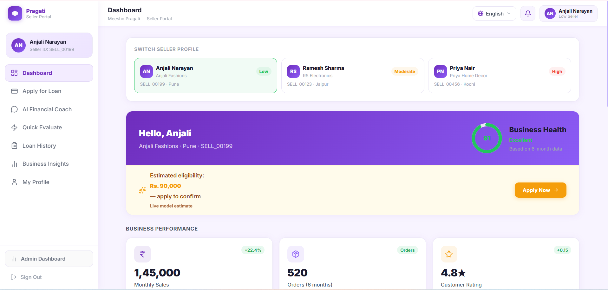
</p>

<p align="center">
  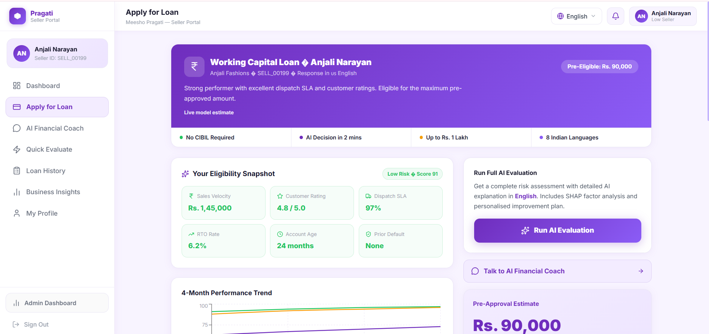
</p>

<p align="center">
  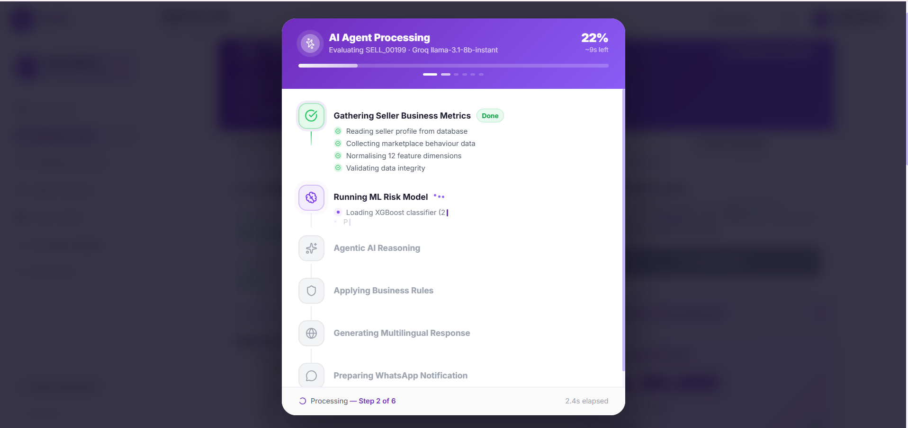
</p>
<p align="center">
  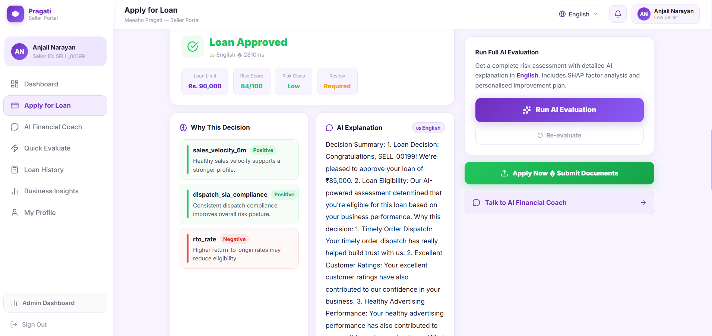
</p>

**Purpose:** Demonstrates the seller evaluation form and underwriting experience.

### Screenshot 2 — Loan workflow and decision presentation

<p align="center">
  
</p>

<p align="center">
  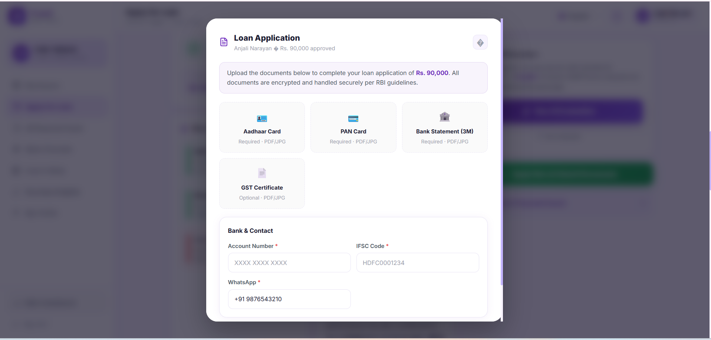
</p>
<p align="center">
  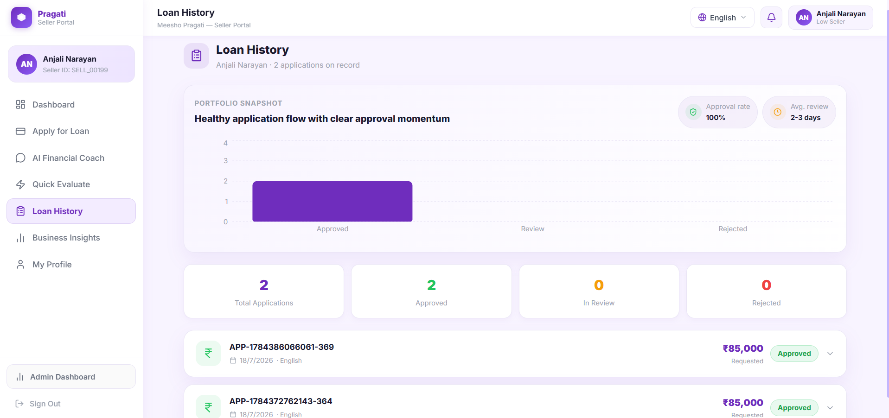
</p>
<p align="center">
  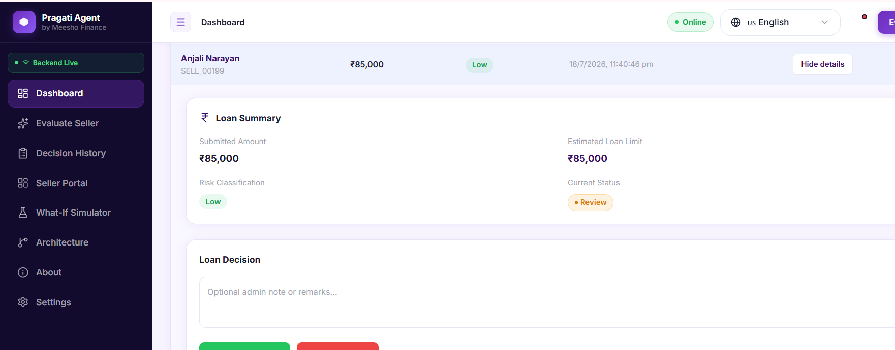
</p>
<p align="center">
  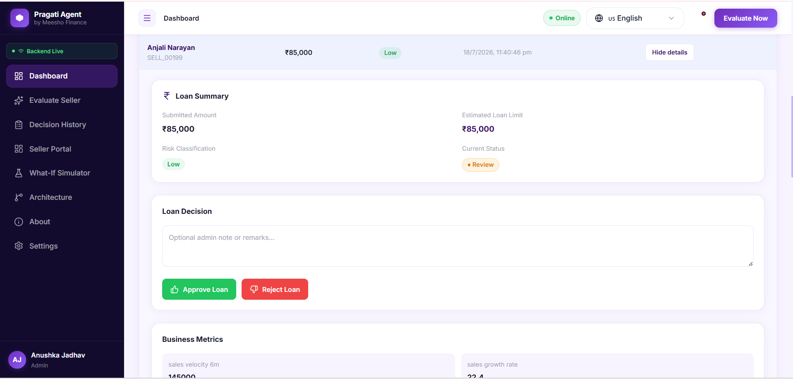
</p>
<p align="center">
  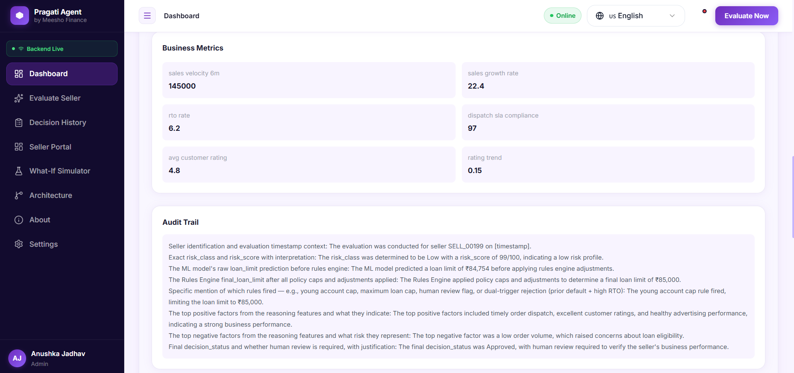
</p>
<p align="center">
  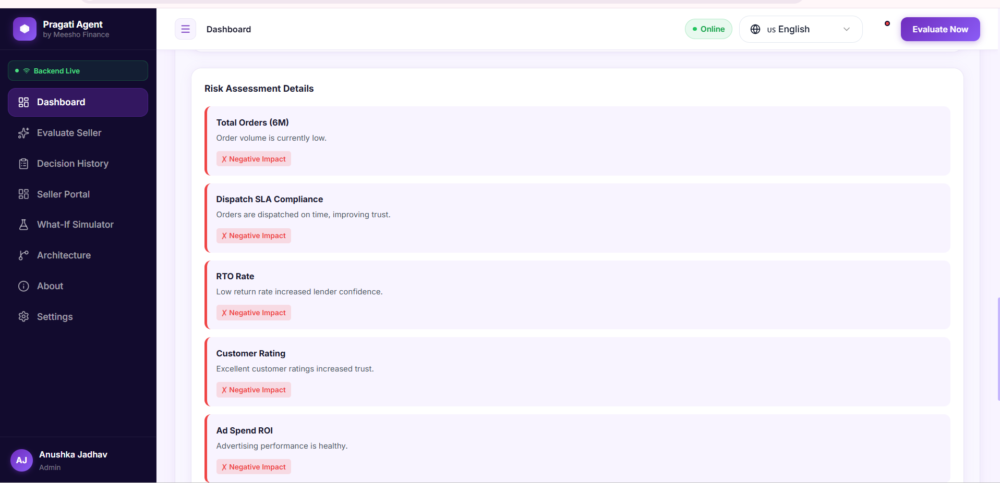
</p>

**Purpose:** Shows how the system presents decision outputs and insights.


### Screenshot 3 — WhatApp Inetegration for Loan Application throught whatapp

<p align="center">
  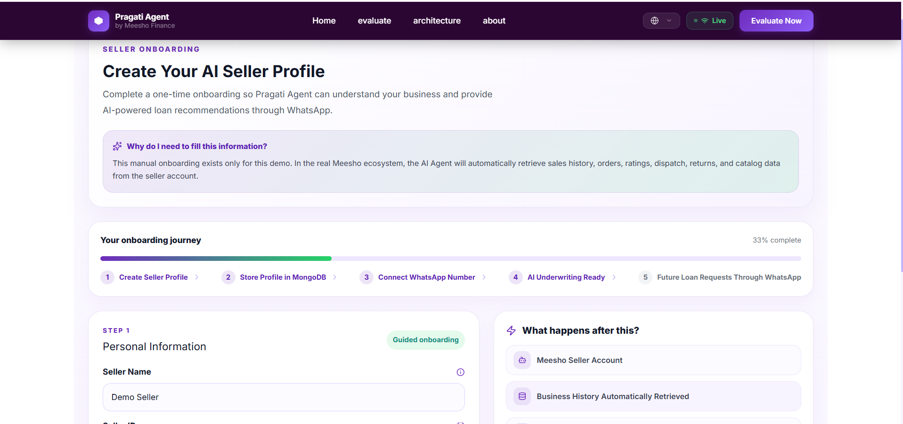
</p>
<p align="center">
  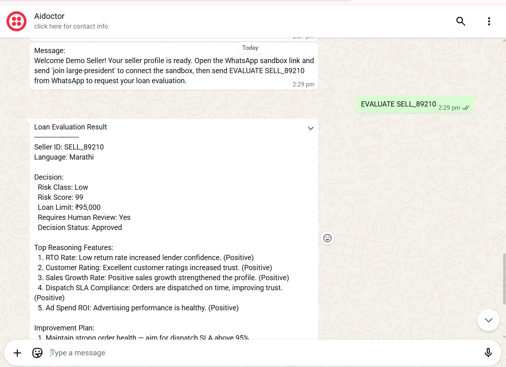
</p>

**Purpose:** Shows the seller get loan approval and limit directly on whatapp.

### Screenshot 4 — Multilingual experience

<p align="center">
  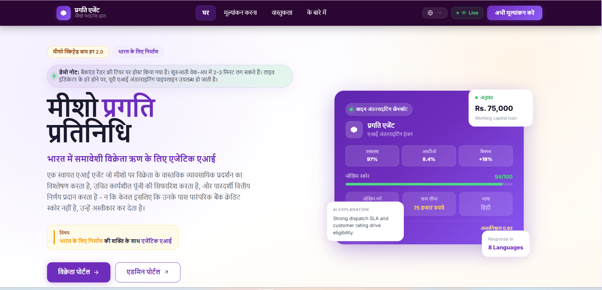
</p>

**Purpose:** Shows the multilingual interface experience.

### Screenshot 5 — Dashboard analytics and review UI

<p align="center">
  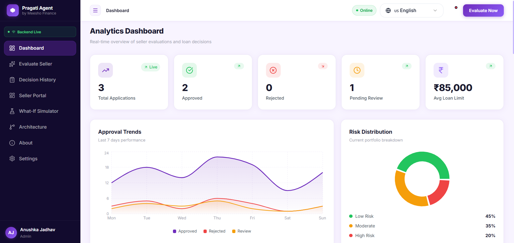
</p>

<p align="center">
  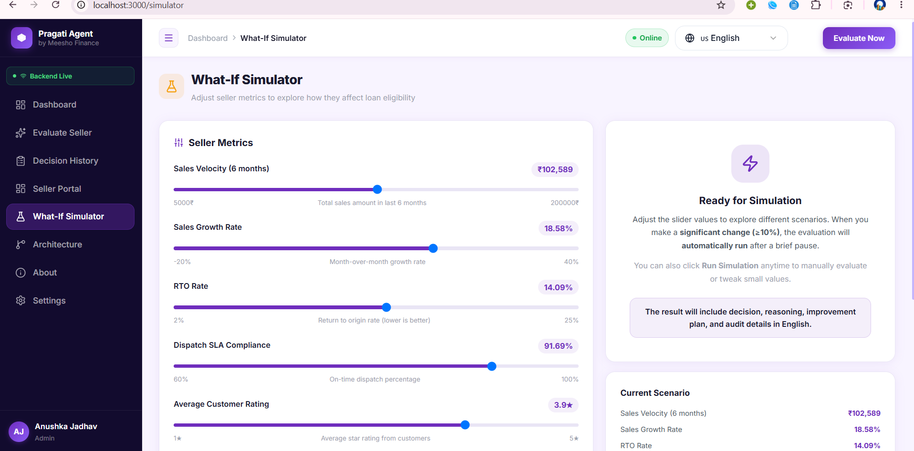
</p>


**Purpose:** Highlights the richer analytics and dashboard presentation.

---

## 19. Demo Video

A demo video is not present in the repository yet. When a video file is added, it can be embedded directly here using a video tag or a clickable preview link.

---

## 20. Future Improvements

The next step is to make the prototype production-ready.

### Planned enhancements

- Real Meesho integration
- Live seller analytics from actual seller accounts
- Voice AI and conversational support
- UPI-based disbursement integration
- Fraud detection and risk monitoring
- Repayment prediction
- Seller growth prediction
- Personalized financial coaching

---

## 21. Impact

This project can have a meaningful impact on:

- Meesho Finance by improving underwriting quality
- Instant Cash by reducing rejection friction
- Bharat sellers by making credit more understandable and inclusive
- Women entrepreneurs by lowering barriers to accessible finance
- Financial inclusion by moving away from rigid and opaque credit models
- Transparent lending by making decisions explainable

---

## 22. Project Structure

```text
.
├── backend/
│   ├── src/
│   │   ├── config/
│   │   ├── controllers/
│   │   ├── middleware/
│   │   ├── models/
│   │   ├── prompts/
│   │   ├── routes/
│   │   ├── services/
│   │   └── utils/
│   ├── tests/
│   ├── server.js
│   ├── package.json
│   └── .env.example
├── frontend/
│   ├── src/
│   │   ├── components/
│   │   ├── context/
│   │   ├── hooks/
│   │   ├── pages/
│   │   ├── services/
│   │   └── utils/
│   ├── package.json
│   └── .env.example
├── ml-model/
│   ├── app/
│   ├── artifacts/
│   ├── models/
│   ├── train_model.py
│   ├── requirements.txt
│   └── sellers_synthetic.csv
├── screenshot/
├── docker-compose.yml
├── README.md
├── DEPLOYMENT_QUICK_REFERENCE.md
├── GOOGLE_TRANSLATION_SETUP.md
└── *.pdf
```

---

## 23. Contributors

- Team Meesho Pragati Agent
- Hackathon participants and contributors
- Open-source contributors and reviewers

---

## 24. License

This project is licensed under the MIT License.
